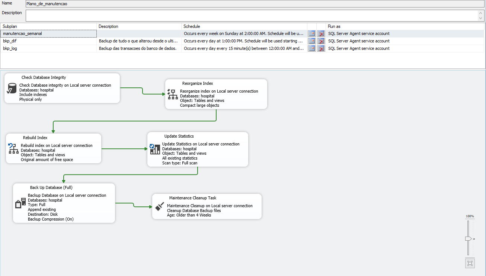
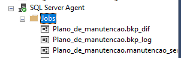

## 🛠️ Plano de Manutenção e Estratégia de Backup

Para garantir a alta disponibilidade, integridade dos dados e a segurança contra desastres (Disaster Recovery) do banco de dados hospitalar, foi implementado um Plano de Manutenção automatizado via **SQL Server Agent**, estruturado em três subplanos distintos baseados nos requisitos de RPO (Recovery Point Objective) e RTO (Recovery Time Objective) de um ambiente de saúde crítico.

### 📐 Arquitetura do Plano

#### 1. Subplano Semanal (Otimização e Integridade)
* **Frequência:** Todo domingo às 02:00 AM.
* **Ações:**
  * `Check Database Integrity`: Verificação de corrupção física/lógica nas páginas de dados.
  * `Index Rebuild/Reorganize`: Manutenção preventiva para mitigar a fragmentação de índices.
  * `Update Statistics`: Atualização dos metadados para otimização dos planos de execução de consultas.
  * `Backup FULL`: Cópia de segurança completa da base pós-otimização.

#### 2. Subplano Diário (Backup Diferencial)
* **Frequência:** De segunda a sábado às 23:00 PM.
* **Ação:** `Backup DIFF` para consolidar as alterações diárias e otimizar o tempo de uma eventual restauração.

#### 3. Subplano de Alta Frequência (Backup de Log)
* **Frequência:** A cada 15 minutos, 24/7.
* **Ação:** `Backup de Transaction Log` para garantir perda quase zero de dados de prontuários e atendimentos em caso de desastre.

---

### 🧹 Política de Retenção e Purga (Cleanup)
Para gerenciar o espaço em disco devido à alta frequência dos logs, foi configurada uma **Maintenance Cleanup Task**:
* **Arquivos .bak (Full/Diff):** Retenção de 4 semanas.
* **Arquivos .trn (Logs):** Retenção de 2 semanas.

---

### 📸 Evidências de Implementação

  

*Legenda: Fluxo lógico e encadeamento das tarefas de manutenção no SSMS.*

  

*Legenda: Automação dos subplanos refletida diretamente nos Jobs do SQL Server Agent.*
