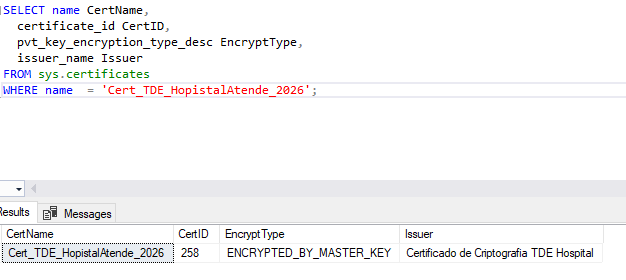
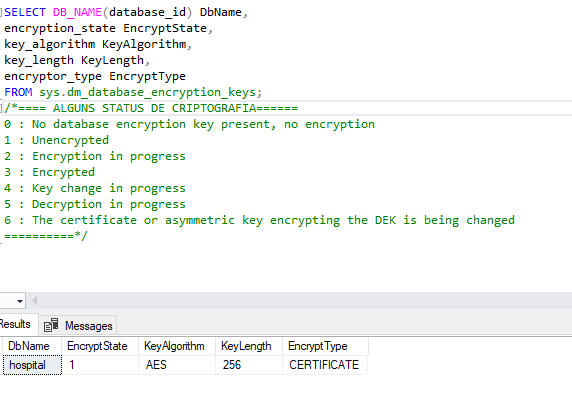
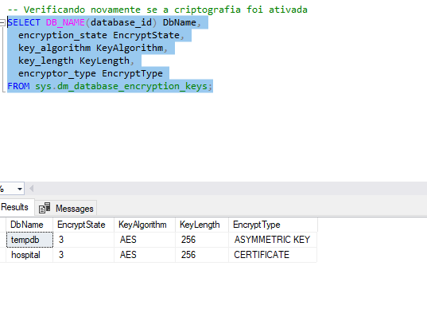
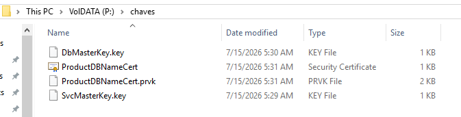
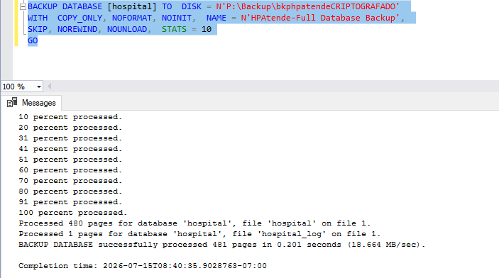

# 🔐 Criptografia Transparente de Dados (TDE) - v4

Este módulo implementa a **Criptografia Transparente de Dados (Transparent Data Encryption - TDE)** no banco de dados do hospital. Esta é uma medida de segurança de nível corporativo, obrigatória em ambientes de saúde regulamentados (atendendo a diretrizes de governança e proteção de dados sensíveis, como a LGPD.

O TDE protege as páginas de dados e de log diretamente nos arquivos físicos (`.mdf` e `.ldf`), além de garantir que **todos os backups gerados a partir deste momento também nasçam criptografados**. Se os arquivos forem roubados do disco, eles se tornam completamente inúteis sem as chaves contidas no servidor de origem.

---

## 🏛️ Fluxo Lógico e Hierarquia de Chaves

A ativação do TDE foi realizada seguindo a estrita árvore de dependências criptográficas do SQL Server:

```
[Service Master Key] (Gerada automaticamente no nível da Instância)
       └── [Database Master Key (DMK)] (Criada na base master)
              └── [Certificado] (Criado na base master e protegido pela DMK)
                     └── [Database Encryption Key (DEK)] (Criada na base hospital e protegida pelo Certificado)
```

---

## 🚀 Etapas do Script de Implementação

O script foi estruturado de forma linear e auditada, validando cada etapa antes de avançar para a próxima:

### 1. Inicialização da Database Master Key (DMK)
Criação da chave mestre no banco `master` utilizando uma senha forte de criptografia.
* **Validação:** Consulta à view `sys.symmetric_keys` para garantir a integridade da chave gerada e da chave de serviço (SMK).

### 2. Criação e Auditoria do Certificado
Geração do certificado de proteção do servidor, responsável por blindar a chave que encriptará o hospital.
* **Validação:** Consulta à tabela do sistema `sys.certificates` para checar as propriedades e o tipo de criptografia do par de chaves privadas.

<p align="center">
  
</p>
<p align="center"><em>Evidência: Metadados do certificado criado com sucesso na base master.</em></p>

### 3. Criação da DEK (Database Encryption Key)
Contextualização na base `hospital` para a criação da chave de criptografia do banco, utilizando o algoritmo de padrão de mercado **`AES_256`**.
* **Auditoria de Estado:** Consulta à DMV `sys.dm_database_encryption_keys`. Neste momento, o estado da criptografia encontra-se como **`1` (Unencrypted)**.

<p align="center">
  
</p>
<p align="center"><em>Evidência: Chave DEK associada ao banco, porém aguardando ativação (EncryptState = 1).</em></p>

### 4. Ativação da Criptografia em Repouso
Execução do comando `ALTER DATABASE hospital SET ENCRYPTION ON;`, iniciando o processo de encriptação em segundo plano de todas as páginas de dados.
* **Auditoria Final:** Nova consulta à DMV para validar a virada de chave para o status **`3` (Encrypted)**.

<p align="center">
  
</p>
<p align="center"><em>Evidência: Banco de dados hospital totalmente protegido e criptografado (EncryptState = 3).</em></p>

---

## 🛡️ Salvaguarda Estratégica: Backup das Chaves (Disaster Recovery)

> ⚠️ **Maturidade Operacional:** Se o servidor físico sofrer uma pane, os backups do banco de dados **só poderão ser restaurados em outra instância se o DBA possuir os arquivos das chaves e do certificado**.

Como boa prática de governança, o script realiza a exportação segura de toda a hierarquia criptográfica para um diretório seguro externo (simulado em `P:\chaves\`):
* **Backup da Service Master Key (`.key`)**
* **Backup da Database Master Key (`.key`)**
* **Backup do Certificado (`.cer`) e exportação da Chave Privada (`.prvk`)** protegida por senha.

<p align="center">
  
</p>
<p align="center"><em>Evidência: Arquivos criptográficos salvaguardados com sucesso para fins de Disaster Recovery.</em></p>

> *Nota de conformidade: Em um ambiente produtivo real, os arquivos binários gerados e suas respectivas senhas jamais seriam armazenados em um repositório público do GitHub, sendo guardados em cofres de credenciais criptografados.*

---

## 💾 Carga e Validação do Backup Criptografado

Por fim, para consolidar a segurança de ponta a ponta, foi gerado um backup completo do banco utilizando a flag `COPY_ONLY` (para não quebrar a cadeia de logs do nosso plano de manutenção). 

O arquivo resultante herda as propriedades de criptografia do TDE nativamente, impedindo vazamento de dados caso a mídia física de backup seja interceptada.

<p align="center">
  
</p>
<p align="center"><em>Evidência: Processamento e conclusão do arquivo de backup blindado pelo TDE.</em></p>